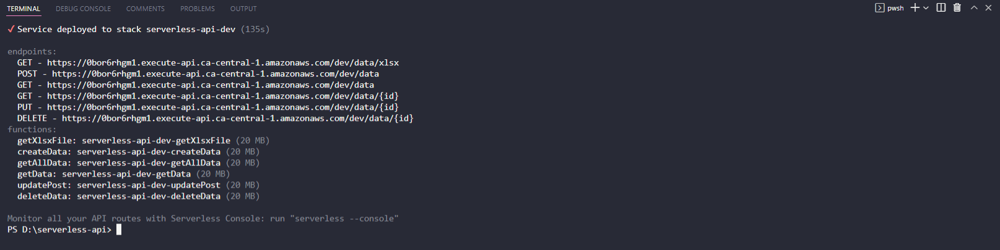

# Serverless CRUD REST API
 

<h2>Documentation Link: <a href="https://jatin711-debug.github.io/serverless-api-qrvey-assignment">Click Here</a> </h2>

 
<ul>
    <h3>Quick Links: </h3>
    <li><a href="#usage">Usage</a></li>
    <li><a href="#deployment">Deployment</a></li>
</ul>
 

 

## Usage:
<table>
    <tr>
        <th>No.</th>
        <th>Method Type</th>
        <th>EndPoints</th>
    </tr>
    <tr>
        <td>1.</td>
        <td>POST</td>
        <td>https://0bor6rhgm1.execute-api.ca-central-1.amazonaws.com/dev/data</td>
    </tr>
    <tr>
        <td>2.</td>
        <td>GET</td>
        <td>https://0bor6rhgm1.execute-api.ca-central-1.amazonaws.com/dev/data</td>
    </tr>
    <tr>
        <td>3.</td>
        <td>GET</td>
        <td>https://0bor6rhgm1.execute-api.ca-central-1.amazonaws.com/dev/data/{id}</td>
    </tr>
    <tr>
        <td>4.</td>
        <td>PUT</td>
        <td>https://0bor6rhgm1.execute-api.ca-central-1.amazonaws.com/dev/data/{id}</td>
    </tr>
    <tr>
        <td>5.</td>
        <td>DELETE</td>
        <td>https://0bor6rhgm1.execute-api.ca-central-1.amazonaws.com/dev/data/{id}</td>
    </tr>
    <tr>
        <td>6.</td>
        <td>GET</td>
        <td>https://0bor6rhgm1.execute-api.ca-central-1.amazonaws.com/dev/data/xlsx</td>
    </tr>
</table>
 

 

    <h3>Sending Post Request to Api with /data EndPoint using Postman</h3>
    
    <h3>Response We Get:</h3>
    

 

 

    <h3>Sending Get Request to Api with /data EndPoint using Postman</h3>
    
    <h3>Sending Get Request to Api with /data/{id} EndPoint using Postman</h3>
    

 

 

    <h3>Sending Put Request to Api with /data/{id} EndPoint using Postman</h3>
    
    <h3>Sending Get Request to Api with /data/{id} EndPoint using Postman To Check For Updates</h3>
    

 

 

    <h3>Sending Delete Request to Api with /data/{id} EndPoint using Postman</h3>
    
    <h3>Sending Get Request to Api with /data EndPoint using Postman To Check For Data</h3>
    
    <h3>Sending Get Request to Api with /data/{id} EndPoint using Postman To Check For Data</h3>
    

 

 

## Deployment:

    <h3>Requirements:</h3>
    <ul>
        <li><a href="https://docs.aws.amazon.com/cli/latest/userguide/getting-started-install.html">AWS CLI</a> along with aws account and its credentials configured</li>
        <li><a href="https://nodejs.org/en/" >NodeJs</a></li>
        <li><a href="https://git-scm.com/" >Git</a></li>
    </ul>
    <h3>Process:</h3>
    <ol>
        <li>Clone this repository,run > git clone https://github.com/jatin711-debug/serverless-api-qrvey-assignment.git</li>
        <li>npm install && npm install -g serverless</li>
        <li>serverless deploy</li>
    </ol>
    

